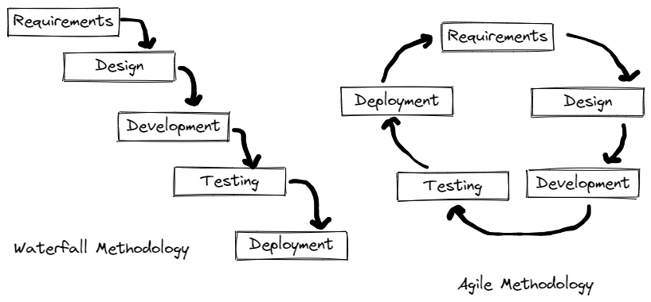

# Testing & SDLC (Software Development Life-Cycle)

## Objectives

* Students should be able to list the pros and cons associated with Manual versus Automated testing
* Students should be able to state the difference between Exploratory and Regression testing
* Students should be able to state the difference between Unit, Integration and Acceptance testing
* Students should be able to create and run Unit tests
* Students should be able to effectively choose the proper asserts from an xUnit framework
* Students should be able to describe boundary cases and how to spot what the boundary cases are in a piece of code

__Could you answer questions around these topics in an interview?__

## Waterfall vs Agile

[More Info](https://www.guru99.com/waterfall-vs-agile.html)

## Testing

## Two Different Ways Testing is Done

- **Manual vs Automated Testing**    
    - *What are the strengths of human testers?*
    - *What are the strengths of computers?*

    - Manual Testing - done by an actual person 
        - Potential for human error
        - Can be inconsistent from session to session
        - Allows for creativity & spontaneity
        - Can evaluate subjective qualities like user friendliness and usability
    - Automated Testing - coded/scripted, can be setup to run automatically
        - Speed / Efficiency
        - Lower cost of execution, but can be more expensive to initially write
        - High Accuracy / Dependability 
        - Consistent & Repeatable
    
## Types of Testing Have Different Focus

    - Exploratory Testing - explores the functionality of the system looking for defects, missing features, 
        or other opportunities for improvement. Almost always manual.

    - Regression Testing - validates that existing functionality continues to operate as expected. 

    - __Unit Testing__
        - Done by the developers as they write the code
        - TDD - Test Driven Development - write tests first, they fail, as you write code, you make the tests pass
        - BDD - Behavior Driven Development - focus is on behaviors (which are represented by method)
    
    - Integration Testing - testing different parts of the system (that have already been tested in isolation) making
        sure that they behave correctly together
        
    - Acceptance Testing - Done by the customers, validates that you delivered what you said you would and that 
        it behaves properly (in their eyes)
